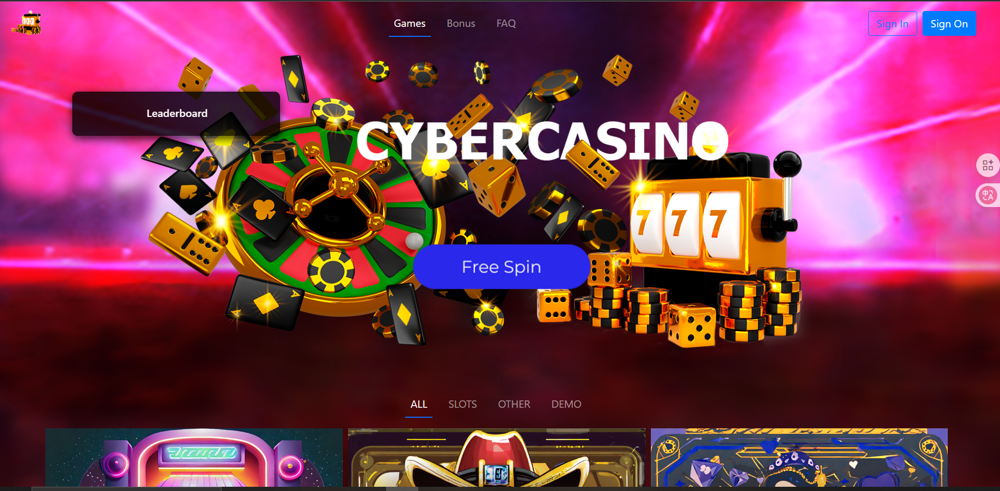

# CyberCasino



## Overview
CyberCasino is a comprehensive web application developed as a group project for the Web Application university course. It features various casino games including Blackjack, Roulette, and Slot Machines, all built with a modern Angular frontend.

## Members
- Ernesto Cesario
- Daniele Galasso
- Domenico Visciglia
- Federico Di Franco

## Technologies Used
- **Frontend:** Angular 17
- **Styling:** Bootstrap 5, SCSS
- **State/Logic:** TypeScript, RxJS

## Getting Started

### Prerequisites
- Node.js
- NPM (Node Package Manager)
- Angular CLI (`npm install -g @angular/cli`)

### Installation

1. Clone the repository:
   ```bash
   git clone <repository-url>
   ```
2. Navigate to the project directory:
   ```bash
   cd CYBER-CASINO
   ```
3. Install dependencies:
   ```bash
   npm install
   ```

### Development Server

Run `ng serve` for a dev server. Navigate to `http://localhost:4200/`. The application will automatically reload if you change any of the source files.

### Build

Run `ng build` to build the project. The build artifacts will be stored in the `dist/` directory.

## License
This project contains some assets for which attribution is required:
- Slot machine elements use images by upklyak taken on freepik at [freepik.com](https://www.freepik.com/upklyak)
- Slot machine sfx are taken from Pierre Cartoon Sounds at [freesound.org](https://freesound.org/people/pierrecartoons1979/)
- Horse race images were created by KITSANTAS FOTIOS
